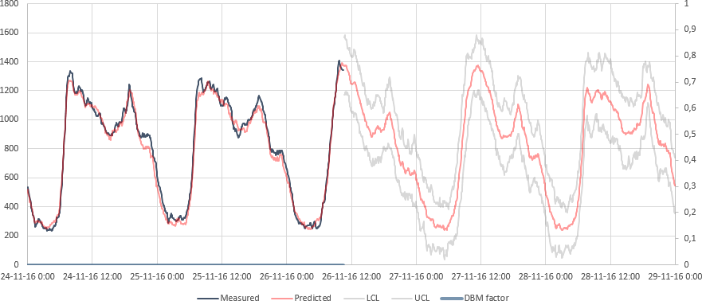
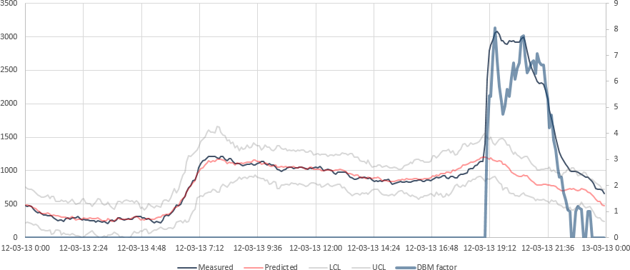
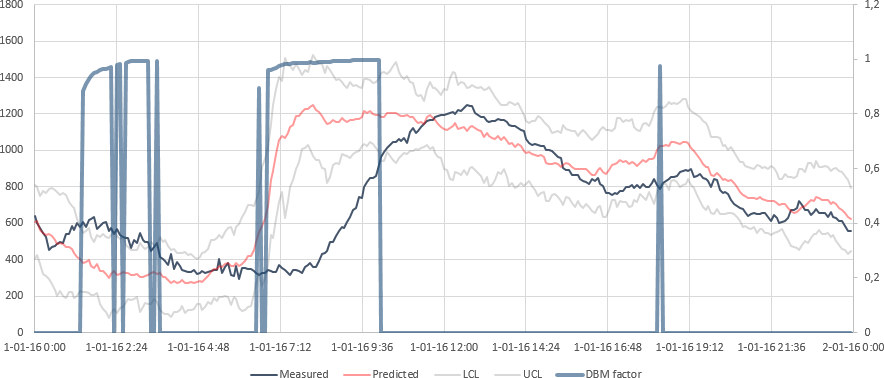
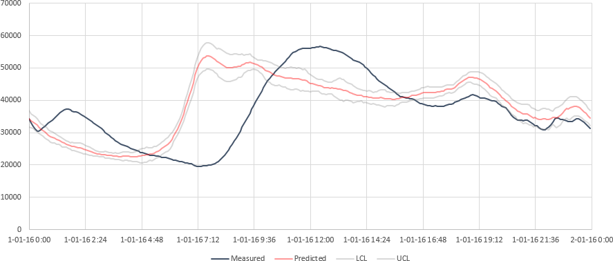

# DBM
Dynamic Bandwidth Monitor  
Leak detection method implemented in a real-time data historian

* J.H. Fitié, Vitens N.V. <[johan.fitie@vitens.nl](mailto:johan.fitie@vitens.nl)>
* E.A. Trietsch, Vitens N.V. <[eelco.trietsch@vitens.nl](mailto:eelco.trietsch@vitens.nl)>

https://github.com/jfitie/DBM

## Samples

### Sample 1 - Prediction

[Sample 1 data](docs/sample1.csv)

In this example, two days before and after the current day are shown. For historic values, the measured data (black) is shown along the with predicted value (red). The upper and lower control limits (gray) were not crossed, so the DBM factor value (blue) equals zero. For future values, the prediction is shown along with the upper and lower control limits.

```
Option Explicit
Option Strict
Module Module1
    Public Sub Main
        Dim _DBM As New DBM
        Dim _PISDK As New PISDK.PISDK
        Dim s,e As DateTime
        Dim r As New DBMResult
        Dim PD As New DBMPointDriver(_PISDK.Servers("sr-16635").PIPoints("ACE-FR-Deelbalansgebied-Leeuwarden-levering"))
        s=DateAdd("d",-2,DateTime.Today)
        e=DateAdd("d",5,s)
        Do While s<e
            r=_DBM.Calculate(PD,Nothing,s,False)
            Console.WriteLine(s.ToString & vbTab & r.Factor & vbTab & r.CurrValue & vbTab & r.PredValue & vbTab & r.LowContrLimit & vbTab & r.UppContrLimit)
            s=DateAdd("s",DBMConstants.CalculationInterval,s)
        Loop
    End Sub
End Module
```

### Sample 2 - Exception

[Sample 2 data](docs/sample2.csv)

In this example, an exception causes the measured value (black) to cross the upper control limit (gray). The DBM factor value (blue) is greater than one during this time (calculated as _(measured value - predicted value)/(upper control limit - predicted value)_).

```
Option Explicit
Option Strict
Module Module1
    Public Sub Main
        Dim _DBM As New DBM
        Dim _PISDK As New PISDK.PISDK
        Dim s,e As DateTime
        Dim r As New DBMResult
        Dim PD As New DBMPointDriver(_PISDK.Servers("sr-16635").PIPoints("ACE-FR-Deelbalansgebied-Leeuwarden-levering"))
        s=New DateTime(2013,3,12)
        e=DateAdd("d",1,s)
        Do While s<e
            r=_DBM.Calculate(PD,Nothing,s,False)
            Console.WriteLine(s.ToString & vbTab & r.Factor & vbTab & r.CurrValue & vbTab & r.PredValue & vbTab & r.LowContrLimit & vbTab & r.UppContrLimit)
            s=DateAdd("s",DBMConstants.CalculationInterval,s)
        Loop
    End Sub
End Module
```

### Sample 3 - Suppressed exception


[Sample 3 data](docs/sample3.csv)

In this example, an exception causes the measured value (black) to cross the upper control limit (gray). Because the pattern is checked against a similar pattern which has a comparable relative prediction error (calculated as _(predicted value / measured value) - 1_), the exception is suppressed. The DBM factor value is greater than zero and less than, or equal to one (correlation coefficient of the relative prediction error) during this time.

```
Option Explicit
Option Strict
Module Module1
    Public Sub Main
        Dim _DBM As New DBM
        Dim _PISDK As New PISDK.PISDK
        Dim s,e As DateTime
        Dim r As New DBMResult
        Dim PDA As New DBMPointDriver(_PISDK.Servers("sr-16635").PIPoints("ACE-FR-Deelbalansgebied-Leeuwarden-levering"))
        Dim PDB As New DBMPointDriver(_PISDK.Servers("sr-16634").PIPoints("Reinwaterafgifte"))
        s=New DateTime(2016,1,1)
        e=DateAdd("d",1,s)
        Do While s<e
            r=_DBM.Calculate(PDA,PDB,s,False)
            Console.Write(s.ToString & vbTab & r.Factor & vbTab & r.CurrValue & vbTab & r.PredValue & vbTab & r.LowContrLimit & vbTab & r.UppContrLimit)
            r=_DBM.Calculate(PDB,Nothing,s,False)
            Console.WriteLine(vbTab & r.CurrValue & vbTab & r.PredValue & vbTab & r.LowContrLimit & vbTab & r.UppContrLimit)
            s=DateAdd("s",DBMConstants.CalculationInterval,s)
        Loop
    End Sub
End Module
```

## About Vitens
Vitens is the largest drinking water company in The Netherlands. We deliver top quality drinking water to 5.6 million people and companies in the provinces Flevoland, Fryslân, Gelderland, Utrecht and Overijssel and some municipalities in Drenthe and Noord-Holland. Annually we deliver 350 million m³ water with 1,400 employees, 100 water treatment works and 49,000 kilometres of water mains.

One of our main focus points is using advanced water quality, quantity and hydraulics models to further improve and optimize our treatment and distribution processes.

https://www.vitens.nl/

## License
DBM  
Dynamic Bandwidth Monitor  
Leak detection method implemented in a real-time data historian

Copyright (C) 2014, 2015, 2016 J.H. Fitié, Vitens N.V.

This program is free software: you can redistribute it and/or modify it under the terms of the GNU General Public License as published by the Free Software Foundation, either version 3 of the License, or (at your option) any later version.

This program is distributed in the hope that it will be useful, but WITHOUT ANY WARRANTY; without even the implied warranty of MERCHANTABILITY or FITNESS FOR A PARTICULAR PURPOSE.  See the GNU General Public License for more details.

You should have received a copy of the GNU General Public License along with this program.  If not, see <http://www.gnu.org/licenses/>.
