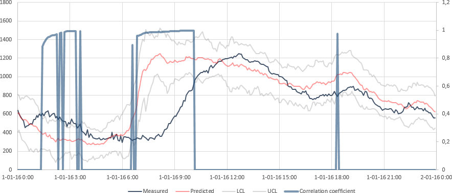
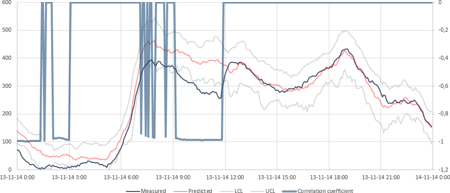

# DBM
Dynamic Bandwidth Monitor  
Leak detection method implemented in a real-time data historian  
Copyright (C) 2014-2020  J.H. Fitié, Vitens N.V.

## Continuous integration
| Build status                                                                                                                                                              | Downloads                                                                 |
| ------------------------------------------------------------------------------------------------------------------------------------------------------------------------- | ------------------------------------------------------------------------- |
|  | [:package: Latest release](https://github.com/Vitens/DBM/releases/latest) |

## Description
Water company Vitens has created a demonstration site called the Vitens Innovation Playground (VIP), in which new technologies and methodologies are developed, tested, and demonstrated. The projects conducted in the demonstration site can be categorized into one of four themes: energy optimization, real-time leak detection, online water quality monitoring, and customer interaction. In the real-time leak detection theme, a method for leak detection based on statistical demand forecasting was developed.

Using historical demand patterns and statistical methods - such as median absolute deviation, linear regression, sample variance, and exponential moving averages - real-time values can be compared to a forecast demand pattern and checked to be within calculated bandwidths. The method was implemented in Vitens' realtime data historian, continuously comparing measured demand values to be within operational bounds.

One of the advantages of this method is that it doesn't require manual configuration or training sets. Next to leak detection, unmeasured supply between areas and unscheduled plant shutdowns were also detected. The method was found to be such a success within the company, that it was implemented in an operational dashboard and is now used in day-to-day operations.

### Keywords
Real-time, leak detection, demand forecasting, demand patterns, operational dashboard

## Samples

### Sample 1 - Forecast

In this example, two days before and after the current day are shown. For historic values, the measured data (black) is shown along with the forecast value (red). The upper and lower control limits (gray) were not crossed, so the DBM factor value (blue) equals zero. For future values, the forecast is shown along with the upper and lower control limits. Reliable forecasts can be made for at least seven days in advance.

### Sample 2 - Event

In this example, an event causes the measured value (black) to cross the upper control limit (gray). The DBM factor value (blue) is greater than one during this time (calculated as _(measured value - forecast value)/(upper control limit - forecast value)_).

### Sample 3 - Suppressed event (correlation)

In this example, an event causes the measured value (black) to cross the upper and lower control limits (gray). Because the pattern is checked against a similar pattern which has a comparable relative forecast error (calculated as _(forecast value / measured value) - 1_), the event is suppressed. The DBM factor value is reset to zero during this time.

### Sample 4 - Suppressed event (anticorrelation)

In this example, an event causes the measured value (black) to cross the lower control limit (gray). Because the pattern is checked against a similar, adjacent, pattern which has a comparable, but inverted, absolute forecast error (calculated as _forecast value - measured value_), the event is suppressed. The DBM factor value is reset to zero during this time.

## Program information

### Requirements
| Priority  | Requirement                                                     |
| --------- | --------------------------------------------------------------- |
| Mandatory | Microsoft .NET Framework                                        |
| Optional  | OSIsoft PI Asset Framework Software Development Kit (PI AF SDK) |

### Drivers
DBM uses drivers to read information from a source of data. The following drivers are included:

| Driver                         | Description                             | Identifier (`Point`)                             | Remarks                                                                |
| ------------------------------ | --------------------------------------- | ------------------------------------------------ | ---------------------------------------------------------------------- |
| `DBMPointDriverCSV.vb`         | Driver for CSV files (timestamp,value). | `String` (CSV filename)                          | Data interval must be the same as the `CalculationInterval` parameter. |
| `DBMPointDriverOSIsoftPIAF.vb` | Driver for OSIsoft PI Asset Framework.  | `OSIsoft.AF.Asset.AFAttribute` (PI AF attribute) | Used by PI AF Data Reference `DBMDataRef`.                             |

### Parameters
DBM can be configured using several parameters. The values for these parameters can be changed at runtime in the `Vitens.DynamicBandwidthMonitor.DBMParameters` class.

| Parameter                    | Default value | Units         | Description                                                                                           |
| ---------------------------- | ------------- | ------------- | ----------------------------------------------------------------------------------------------------- |
| `CalculationInterval`        | 300           | seconds       | Time interval at which the calculation is run.                                                        |
| `UseSundayForHolidays`       | True          |               | Use forecast of the previous Sunday for holidays.                                                     |
| `ComparePatterns`            | 12            | weeks         | Number of weeks to look back to forecast the current value and control limits.                        |
| `EMAPreviousPeriods`         | 5             | intervals     | Number of previous intervals used to smooth the data.                                                 |
| `OutlierCI`                  | 0.99          | ratio         | Confidence interval used for removing outliers.                                                       |
| `BandwidthCI`                | 0.99          | ratio         | Confidence interval used for determining control limits.                                              |
| `CorrelationPreviousPeriods` | 23            | intervals     | Number of previous intervals used to calculate forecast error correlation when an event is found.     |
| `CorrelationThreshold`       | 0.83666       | dimensionless | Absolute correlation lower limit for detecting (anti)correlation.                                     |
| `RegressionAngleRange`       | 18.435        | degrees       | Regression angle range (around -45/+45 degrees) required when suppressing based on (anti)correlation. |

### DBMTester
DBMTester is a command line utility that can be used to quickly calculate DBM results using the CSV driver. The following arguments are available:

| Argument | Count  | Description                                                                                                         |
| -------- | ------ | ------------------------------------------------------------------------------------------------------------------- |
| `-i=`    | 1      | Specifies the input point (CSV file).                                                                               |
| `-c=`    | 0..n   | Adds a correlation point (CSV file).                                                                                |
| `-cs=`   | 0..n   | Adds a correlation point (CSV file) from which the input point is subtracted.                                       |
| `-iv=`   | 0..1   | Changes the `CalculationInterval` parameter.                                                                        |
| `-us=`   | 0..1   | Changes the `UseSundayForHolidays` parameter.                                                                       |
| `-p=`    | 0..1   | Changes the `ComparePatterns` parameter.                                                                            |
| `-ep=`   | 0..1   | Changes the `EMAPreviousPeriods` parameter.                                                                         |
| `-oi=`   | 0..1   | Changes the `OutlierCI` parameter.                                                                                  |
| `-bi=`   | 0..1   | Changes the `BandwidthCI` parameter.                                                                                |
| `-cp=`   | 0..1   | Changes the `CorrelationPreviousPeriods` parameter.                                                                 |
| `-ct=`   | 0..1   | Changes the `CorrelationThreshold` parameter.                                                                       |
| `-ra=`   | 0..1   | Changes the `RegressionAngleRange` parameter.                                                                       |
| `-st=`   | 1      | Start timestamp for calculations.                                                                                   |
| `-et=`   | 0..1   | End timestamp for calculations, all intervals in between are calculated.                                            |
| `-f=`    | 0..1   | Output format. `local` (default) for local formatting, `intl` for UTC time and international formatting (ISO 8601). |

### DBMDataRef
DBMDataRef is a custom OSIsoft PI Asset Framework data reference which integrates DBM with PI AF. The `register.bat` script automatically registers the data reference and support assemblies when run on the PI AF server. The data reference uses the parent attribute as input and automatically uses attributes from sibling and parent elements based on the same template containing good data for correlation calculations, unless the `NoCorrelation` category is applied to the output attribute. The value returned from the DBM calculation is determined by the applied property/trait:

| Property/trait | Return value                     |
| -------------- | -------------------------------- |
| None           | Factor                           |
| `Target`       | Measured value                   |
| `Forecast`     | Forecast value                   |
| `Minimum`      | Lower control limit (p = 0.9999) |
| `LoLo`         | Lower control limit (default)    |
| `Lo`           | Lower control limit (p = 0.95)   |
| `Hi`           | Upper control limit (p = 0.95)   |
| `HiHi`         | Upper control limit (default)    |
| `Maximum`      | Upper control limit (p = 0.9999) |

Beginning with PI AF 2018 SP3 Patch 2, all AF plugins must be signed with a valid certificate. Users must ensure any 3rd party or custom plugins are signed with a valid certificate. Digitally signing plugins increases the users' confidence that it is from a trusted entity. AF data references that are not signed could have been tampered with and are potentially dangerous. Therefore, in order to protect its users, OSIsoft software enforces that all AF 2.x data reference plugins be signed. Use `sign.bat` to sign the data reference and support assemblies with your pfx certificate file before registering the data reference with PI AF.

### License
This program is free software: you can redistribute it and/or modify it under the terms of the GNU General Public License as published by the Free Software Foundation, either version 3 of the License, or (at your option) any later version.

This program is distributed in the hope that it will be useful, but WITHOUT ANY WARRANTY; without even the implied warranty of MERCHANTABILITY or FITNESS FOR A PARTICULAR PURPOSE.  See the GNU General Public License for more details.

You should have received a copy of the GNU General Public License along with this program.  If not, see <http://www.gnu.org/licenses/>.

## About Vitens
Vitens is the largest drinking water company in The Netherlands. We deliver top quality drinking water to 5.7 million people and companies in the provinces Flevoland, Fryslan, Gelderland, Utrecht and Overijssel and some municipalities in Drenthe and Noord-Holland. Annually we deliver 350 million m3 water with 1,400 employees, 100 water treatment works and 50,000 kilometres of water mains.

One of our main focus points is using advanced water quality, quantity and hydraulics models to further improve and optimize our treatment and distribution processes.

https://www.vitens.nl/
